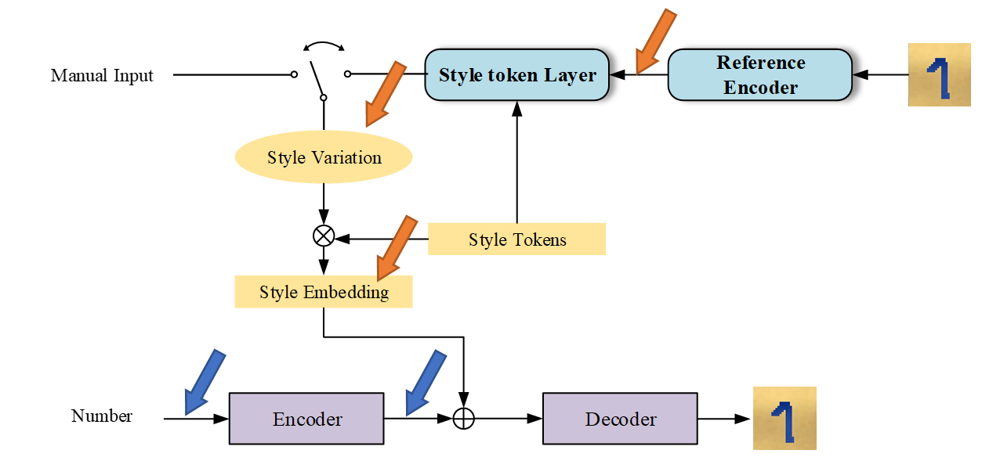

# A Implementation of Style Tokens on MNIST Dataset

## Environment
- Pytorch >= 1.5
- Python >= 3.7

## Network Structure

## Usage

`python train.py`

## Result

## Disentangle Methods

1. DifferLoss from [Domain Separation Networks](https://arxiv.org/abs/1608.06019).
2. Mutual Information
    - [Linear95/CLUB - CLUB: A Contrastive Log-ratio Upper Bound of Mutual Information](https://github.com/Linear95/CLUB)
    - [Wendison/VQMIVC: Official implementation of VQMIVC](https://github.com/Wendison/VQMIVC)
3. Adversial mechanism

## Acknowledgments

Thanks to fungtion/DSN: Pytorch implementation of Domain Separation Networks https://github.com/fungtion/DSN

